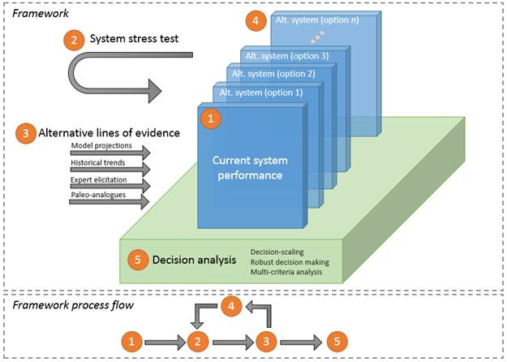
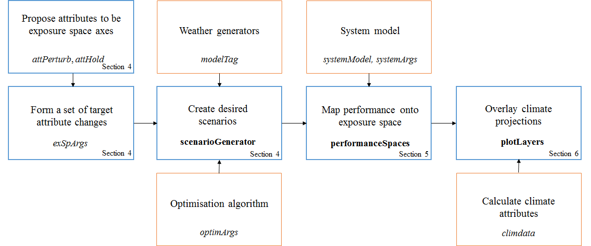
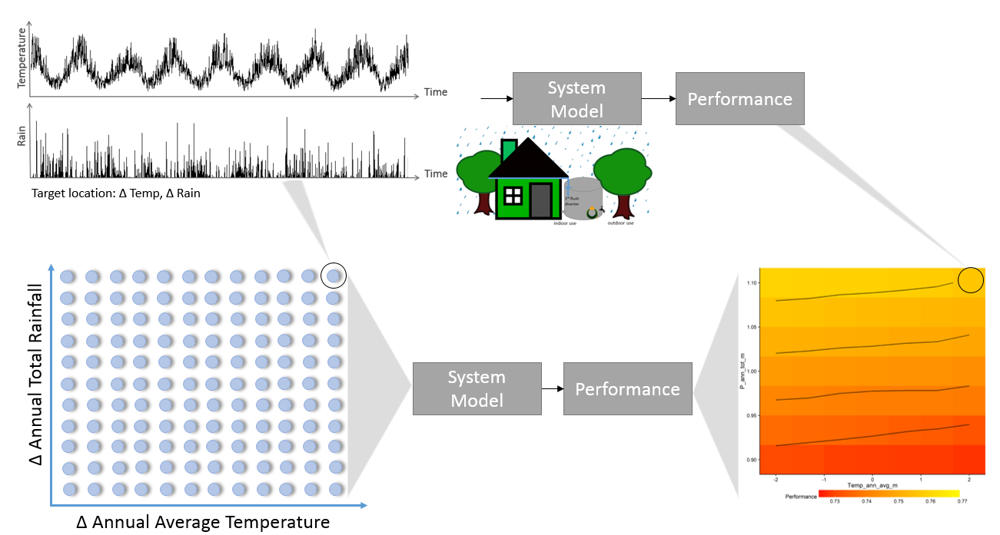
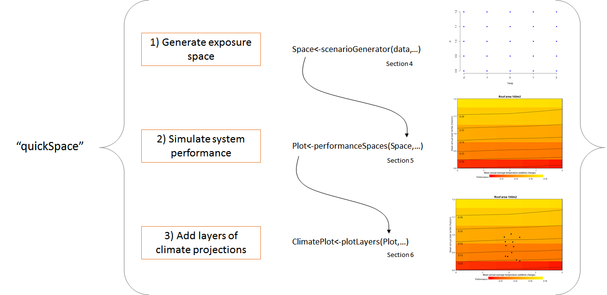
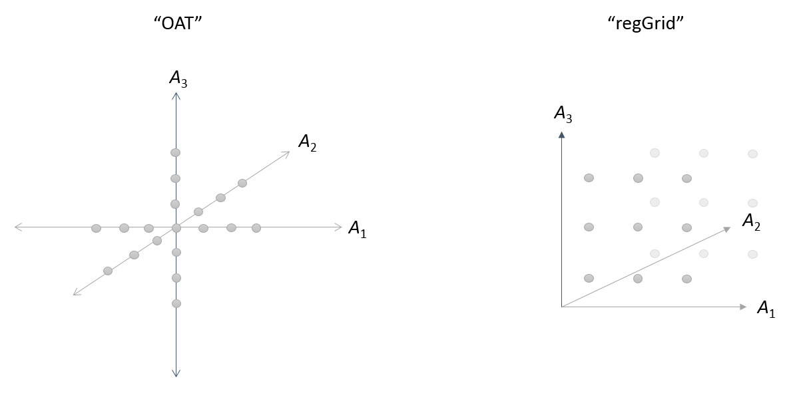
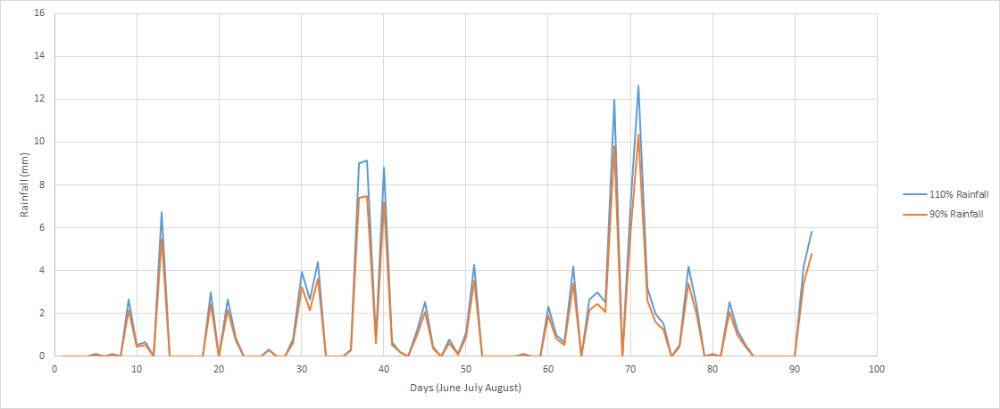
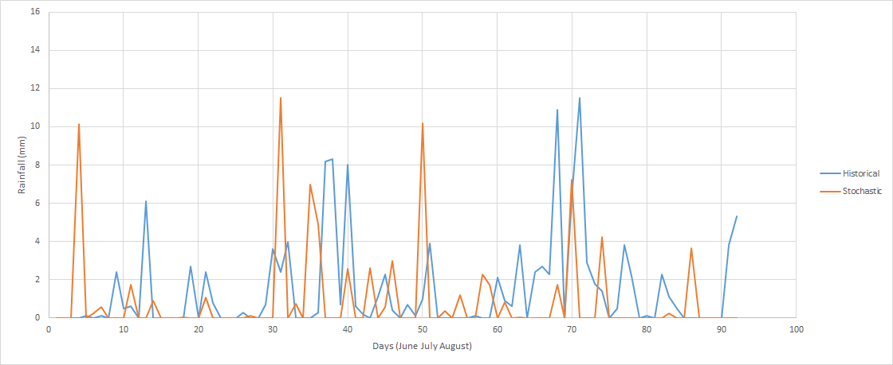
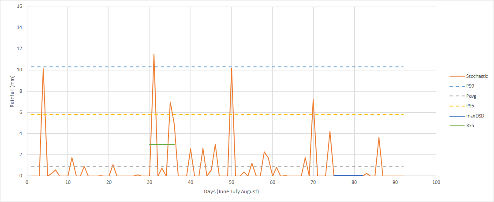
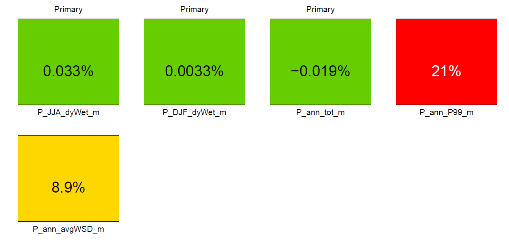
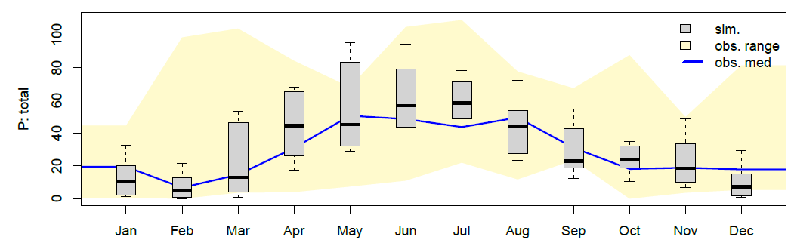

```{r setup, include=FALSE}
library(knitr)
knitr::opts_chunk$set(echo = TRUE)
```
***
# 1 Introduction

A variable and changing climate presents significant challenges to the performance of engineered systems across many sectors, such as municipal, environmental, agricultural, energy, mining, industrial and transport sectors. The systems are designed and expected to operate satisfactorily under a range of climates. However, it is critical to understand the conditions under which system performance might degrade so that alternative contingency measures can be put into place. A range of approaches have emerged in recent years to provide a vulnerability analysis for a system, including bottom-up approaches (Prudhomme et al. 2010), as well as decision-centric approaches that manage climate uncertainty (Brown 2011, Culley et al. 2016, McPhail et al. 2018). In general, a vulnerability analysis should aim to:

- Treat the system as the central concern of the analysis;
-	Recognise systems are inherently complex and links with the climate are often 'non-trivial';
-	Emphasise the importance of system understanding by 'stress-testing' systems against a range of hypothetical and projected climate states;
-	Provide a basis for iterative dialogue between decision makers, system modellers and climate experts about model uncertainty and the implications of different design and operation options;
-	Allow exploration of the implications of deep uncertainty by combining climate projections (via top-down approaches) with hypothetical climate scenarios (via bottom-up approaches) that cover a wider range of possible climatic changes;
-	Enable rapid update of impact assessments under new lines of evidence (e.g. if new climate model results become available);
-	Provide a basis for adaptive planning (including adaptive pathways).

To achieve the above listed aims, this vignette presents a general framework developed from the climate impact assessment literature.

## 1.1 General analysis framework

The framework in this vignette facilitates the following elements:

-	A climate 'stress test' - applied to both the current system design and a set of alternative system designs, to assess the rate of system performance degradation and/or identify situations under which systems can fail;
-	'System performance' - defined in a number of ways, including binary success/failure criteria or quantitative performance measures, and across multiple economic, social and/or environmental measures;
-	Multiple lines of evidence - applied to understand possible future climate changes, including climate model projections (by combining global climate models with dynamical and/or statistical downscaling, or bias corrections), historical climatic changes, expert judgement and/or analogues from paleo records; and
-	Decision analysis - proceeding in multiple ways, analysis can depend on user preference and interpretation of climate uncertainty.

In doing so, the framework: 

- Combines bottom-up style system 'stress testing' with projections from multiple lines of evidence; and 
- Combines traditional climate impact assessments with an analysis of multiple system configurations (or 'options') to identify adaptation options or pathways. 

Decision-centric approaches can be tailored in the framework depending on whether a user interprets climate projections probabilistically (in which case approaches such as cost-benefit analyses and/or quantitative risk assessments may be appropriate) or as scenarios (in which case robustness approaches may be required).

<center></center>
<center><span style="color:darkblue">*A generalised framework for a climate change vulnerability analysis of a system*</span></center>

## 1.2 Overview of this package

The 'foreSIGHT' package demonstrated in this vignette is a tool to be used in many stages of a larger climate impact analysis. The main function of the package is to aid the development of scenario neutral spaces. Its core functionality is to create climate scenarios, and then simulate and visualise system performance. This functionality is useful at all stages for assessment from exploratory stages (where the goal is to understand relationships between climate and a system) to final stages (which require a final description of system vulnerbailites). The key functions and the process flow of the foreSIGHT package is shown in the figure below. Key function arguments are shown in italics, functions names are shown in bold, and orange boxes indicate modules in the process that can be swapped for alternatives to be used by the main process, shown in blue. The section of the vignette which elaborates on each of the stages is also indicated.

<center>{width=720px}</center>
<center><span style="color:darkblue">*Overview of the functions and arguments in this package. The main package functions and arguments are shown in blue, and orange boxes indicate modules that can change with each case study. Default options for these are included in the package, including a demo system model and climate data*</span></center>

Section 4 describes the process of developing scenario neutral spaces, introducing the necessary arguments. First, you must specify the climate attributes you wish to change, and the attributes you wish to monitor but hold constant. Next, you detail how the attributes are changed using *exSpargs*. This will construct a list of target scenarios - time series of climate variables - that will be produced using the **scenarioGenerator** function.

Creating scenarios requires two modules, shown above in orange: a weather generator and an optimisation algorithm. This package includes a selection of weather generators but external models can be implemented instead. The same goes for the optimisation algorithm - this package incudes a genetic algorithm but others can be used in its place.

Section 5 describes another key functionality of the package, which is to visualise the exposure spaces. This requires system response to be attached to each scenario. This can be completed using an internal model using a wrapper function in R, or alternatively, the scenarios can be modelled with an external model and supplied as a response vector. The performance should then be mapped on to the exposure space to visualise the system response. This package supports many graphical options, including heatmaps, contour plots, as well as the control over the final visualisations such as plot titles, axis labels and legends. These settings are all controlled by the **performanceSpaces** function.

Section 6 describes the final stage of this process which is to add other layers of information to the plots. This typically involves climate change projections, which are mapped onto the response surface to examine how plausible the system vulnerabilities are. This information is added using the **plotLayers**  function, which is descrbied along with the necessary arguments.

## 1.3 Installation of package and setup

```{r librarys, include=FALSE}
library(foreSIGHT)
library(cowplot)
```

This package has a number of package dependencies. They should be installed on your computer before loading the foreSIGHT package:

```{r pack, eval=FALSE}

install.packages(c("GA","doParallel","ggplot2","cowplot","directlabels","zoo"))

```

The foreSIGHT package can then be installed from a local zip file. If using RStudio, look for 'Install Packages' option on the 'Tools' menu and select 'Package Archive File'. If using the standard R graphical interface, look for 'Install packages from local files' from the 'Packages' menu. Alternatively, the command below can be used. Make sure to give the full path to the file:

```{r pack2, eval=FALSE}

install.packages("C:\\pathtofile\\foreSIGHT_0.9.tar.gz")

```

You can then load the package with the following command:

```{r pack3}

library(foreSIGHT)

```

The package will generate a large amount of output files and diagnostic plots. It is recommended to have a dedicated working directory. This directory should be created in Windows Explorer, and then be pointed to from inside R with the following command:

```{r pack4, eval=FALSE}

setwd("C:\\path\\to\\working\\directory\\foreSIGHT_test")

```

***
# 2 An example problem

To demonstrate the package's functionality, an example system model and accompanying dataset called 'tank' are used. 'Tank' is a domestic rainwater tank model with enough complexity to highlight key features of the package. The dataset and model can be loaded from the package at any time using the data command:

```{r tank1}

data(tankDat)    #load data -this contains tank_obs for this example

```

The tank model simulates a domestic rainwater tank system, which can be used for both indoor (grey water) applications and garden irrigation. Rain falling on the roof of the house is captured and directed towards the rainwater tank. Before the rainwater is able to enter the tank the first flush is removed from the start of each storm. This removed amount equates to the first millimetre of water falling on the roof and is required for water quality reasons (this can also be varied). The water remaining after the first flush extraction flows into the rainwater tank. Water demand is assumed to be constant throughout the year for indoor use, and vary seasonally for outdoor use. The amount of water supplied by the tank depends on the current water level in the tank calculated at a daily time step.

<center></center>
<center><span style="color:darkblue">*Schematic of the system model*</span></center>

The outdoor seasonal demand pattern responds to the daily temperature (i.e. on hot days, above 28^o^C, the gardener waters more than the seasonal average, but on cool days , below 10^o^C, the gardener waters less than the seasonal average). The tank model simulates each stage of the rainwater capture and use process based on the supplied daily rainfall and temperature time series. The size of both the tank and roof can be varied in the model. Performance is measured according to four metrics:

- Reliability - the fraction of days on which the full demand could be supplied
- Volumetric reliability - the total water supplied as fraction of the total demand
- System efficiency - the amount of water used as a percentage of the water captured by the roof
- Storage efficiency - the amount of water spilled as a percentage of the water captured by the rainwater tank

This example model provides sufficient scope for investigation. This is because the tank responds to multiple climate drivers (i.e. rainfall and temperature), and the removal of the first flush volume at the start of the storm means that the wet-dry pattern of the rainfall and the seasonality of the demand pattern may become important.

A function call to the tank model is shown below. The call returns the system performance which is stored in the object 'performance'. How to use your system model in conjunction with the package will be discussed later.

``` {r demotank}

#Example
data(tankDat)    #load data -this contains tank_obs for this example

systemArgs<-list(roofArea=50,                # roof area in m2
                 nPeople=1,                  # number of people using water
                 tankVol=3000,               # tank volume in L
                 firstFlush=1,               # depth of water on roof removed each event in mm
                 write.file=FALSE,           # write output tank timeseries to file T/F?
                 fnam="tankperformance.csv", # name of file
                 metric="reliability")       # performance metric chosen for reporting

performanceOut=tankWrapper(data=tank_obs,systemArgs=systemArgs)  
performanceOut   #display performance = 0.6882015

#Now try a different metric e.g. volumetric reliability (volRel)
systemArgs<-list(roofArea=50,                # roof area in m2
                 nPeople=1,                  # number of people using water
                 tankVol=3000,               # tank volume in L
                 firstFlush=1,
                 write.file=FALSE,               # write output tank timeseries to file T/F?
                 fnam="tankperformance.csv", # name of file
                 metric="volRel")            # performance metric reported

performanceOut=tankWrapper(data=tank_obs,systemArgs=systemArgs)  
performanceOut   #display performance = 0.4399819

```


Now that we have a system model we can start 'stress-testing' the system's performance under a range of plausible climate scenarios using the scenario-neutral approach. 

##2.1 Developing a scenario neutral approach

The scenario-neutral approach proceeds by first generating an exposure space. This exposure space is composed of target values (attribute combinations) that are of interest. Each target location is a set of climate variable time series (e.g. temperature and rainfall). Each of these sets of climate variable time series are then run through the system model and the resulting performance stored in a performance space. A schematic diagram of the process of generating a performance space is shown below. The procedure follows the three panels:

- Inputs - Target variables such as annual total rainfall and annual average temperature might be identified as critical to the performance of the system. The exposure space considers all possible combinations of these variables. Each possible combination is associated with a timeseries of simulated values that has those attributes.
- Model - Each simulation is applied to the system model generating a relevant performance metric for that simulation.
- Output - The performance metrics for each simulation are mapped corresponding to target input values they represent creating the scenario-neutral performance space.

<center>{width=720px}</center>
<center><span style="color:darkblue">*Schematic of the system model*</span></center>

Over the course of this vignette tutorial you will learn to produce an exposure space, apply it to a system model and produce a performance space.

##2.2 Evalating performance spaces

Once you are comfortable producing performance spaces it is possible to evaluate and compare different system configurations. For example, it is possible to compare different tank sizes for the same property, or compare different contributing roof areas feeding into the same size tank. The figure below illustrates comparison of two performance spaces (contributing roof area of 100 and 110 m^2^) to show the impact that roof area has on the reliability of the tank across a range of potential climates. A set of climate projections for the region has been overlain in black. Comparing the contour lines of the reliability performance metric, it is clear that the 10% increase in the contributing roof area increases reliability across the space. Comparing the orientation of the contours, it is clear that the each system (100 and 110 m^2^) responds to changes in climate in a similar way (e.g. the system is still more sensitive to changes in annual total rainfall than annual average temperature).

```{r simple,echo=FALSE, dpi=100, results='hide',warning=FALSE,message=FALSE}
data(tankDat)
data(climdata2030)

#Inputs for quickSpace
modelTag <- "Simple-ann"
attPerturb <- c("P_ann_tot_m","Temp_ann_avg_m")
exSpArgs <- list(type = "regGrid",
               samp = c(5,5),
               bounds = list("P_ann_tot_m"=c(0.8,1.2),
                             "Temp_ann_avg_m"=c(-2,2)))

systemArgs<-list(roofArea=100,   
                 nPeople=1,
                 tankVol=2000,
                 firstFlush=1,
                 write.file=F,
                 metric="reliability")

plotArgs<-list(title="Roof area 100 m2",
               performancelimits=c(0.705, 0.79),
               ylim=c(0.8,1.201),
               xtitle="Temp_ann_avg_m",   #Specify axes!
               ytitle="P_ann_tot_m")

climArgs<-list(performancelimits=NULL,    #Specify how to plot climate data overlay
               label=NULL,
               slice=2030,
               colour="black",
               fill="performance")

p1<-quickSpace(obs=tank_obs,
               attPerturb=attPerturb,
               exSpArgs=exSpArgs,
               systemModel = tankWrapper,
               systemArgs = systemArgs,
               plotArgs=plotArgs,
               climdata = climdata,
               climArgs=climArgs)


```

```{r simple2,echo=FALSE,dpi=100, results='hide',warning=FALSE,message=FALSE}

systemArgs<-list(roofArea=110,
                 nPeople=1,
                 tankVol=2000,
                 firstFlush=1,
                 write.file=F,
                 metric="reliability")

plotArgs<-list(title="Roof area 110 m2",
               performancelimits=c(0.705, 0.79),
               ylim=c(0.8,1.201),
               xtitle="Temp_ann_avg_m",   #Specify axes!
               ytitle="P_ann_tot_m")

climArgs<-list(performancelimits=NULL,    #Specify how to plot climate data overlay
               label=NULL,
               slice=2030,
               colour="black",
               fill="performance")

p2<-quickSpace(obs = tank_obs,
               attPerturb = attPerturb,
               exSpArgs = exSpArgs,
               systemModel = tankWrapper,
               systemArgs = systemArgs,
               plotArgs = plotArgs,
               climdata = climdata,
               climArgs=climArgs)

```

```{r simple3, results='hide',fig.align='center',echo=FALSE,dpi=60,fig.height=5.5,fig.width=12}

cowplot::plot_grid(p1,p2,align="h",ncol=2)

```

***
# 3 Making a QuickSpace

The above exposure space plots for the case study are made from the three main functions of the package; scenarioGenerator, performanceSpaces and plotLayers. The use of these three components can be automated with the **quickSpace** function. 

<center>{width=720px}</center>
<center><span style="color:darkblue">*An overview of the quickSpace function, and how it implements the three main package steps*</span></center>

As the **quickSpace** function is designed to automate the process, there is only a minimum level of control over the spaces. If more control and customisation over the spaces is needed then each individual function can instead be called separately. **quickSpace** has many of the arguments set to default values, leaving only a minimum specification of information needed to get started:

- historical data (*obs*)
- the climate attributes to change (*attPerturb*, *exSpArgs*)
- a system model and its arguments (*systemModel*, *systemArgs*)
- climate projection data to overlay (*climData*)

This function can be used in the following way:

```{r quickSpace, results='hide',fig.align='center',dpi=100,fig.width=6,fig.height=6}
data(tankDat)
data(climdata2030)

#Inputs for quickSpace
modelTag <- "Simple-ann"                        # Model used to generate scenarios
attPerturb <- c("P_ann_tot_m","Temp_ann_avg_m") # Attributes to perturb
exSpArgs <- list(type = "regGrid",              # Sets out how space is sampled
               samp = c(5,5),
               bounds = list("P_ann_tot_m"=c(0.8,1.2),
                             "Temp_ann_avg_m"=c(-2,2)))
#Inputs for system model
systemArgs<-list(roofArea=100,   
                 nPeople=1,
                 tankVol=2000,
                 firstFlush=1,
                 write.file=F,
                 metric="reliability")

#Plot arguments
plotArgs<-list(title="Roof area 100 m2",
               performancelimits=c(0.705, 0.78),
               ylim=c(0.8,1.20),
               xtitle="Temp_ann_avg_m",   #Specify axes (missing these will cause a plot error)
               ytitle="P_ann_tot_m")

p1<-quickSpace(obs=tank_obs,
           attPerturb=attPerturb,
           exSpArgs=exSpArgs,
           systemModel = tankWrapper,
           systemArgs = systemArgs,
           plotArgs=plotArgs,
           climdata = climdata)

p1

```

This plot is a recreation of the left panel in the above example. Changing the *roofArea* argument to 110 and using the code again would create the panel on the right.

# 4 Creating exposure spaces

This section introduces the **scenarioGenerator** function, which is used to take a historical climate record and perturb it to have particular characteristics for 'stress-testing'. These characteristics of the climate variable time series are termed attributes. The **scenarioGenerator** function requires a number of arguments to specify which attributes should be perturbed and which should be held constant, the combinations of which create a list of target scenarios that together, build an exposure space. Section 3.1 explains these arguments, and Section 3.2 details the options for creating the target scenarios.

## 4.1 Specifying an exposure space

Each call of the **scenarioGenerator** function begins by calculating attributes on provided historical data. These values are used as a baseline for further scenario creation. There are two arguments that are used to specify which attributes should be calculated, and which one you should use depends on intended design of the exposure space.

*attPerturb* is used to specify climate attributes you wish to change in some way. These will typically become axes on an exposure space, as they will in turn show change in system response. 

*attHold* is used to specify attributes you wish to examine, but do not wish to apply changes to. Attributes shouldn't be specified in both categories, they belong in one or the other.

*exSpArgs* is then used to specify the size of the exposure space. For each attribute in *attPerturb*, the range you wish to change the attribute over, and the number of samples, needs to be explained. *exSpArgs* contains three arguments itself to do this; *bounds*, *samp* and *type*. 

- The *bounds* argument is used to set an axis range for each attribute. Its format is therefore required to be a list, with every attribute in attPerturb given *bounds*  explicitly. For temperature you need to specify the change in degrees; however, for rainfall or potential evapotranspiration changes should be specified as fractions of the historical climate attribute value. 

- The *samp* argument specifies the number of samples to take inside the bound range, inclusive of the limits themselves (see above example). 

- The *type* argument sets the type of exposure space constructed from the perturbations, with two currently supported options: one at a time (oat) and regular grid (regGrid).

<center>{width=720px}</center>
<center><span style="color:darkblue">*Layouts of the exposure spaces created by 'oat' and 'regGrid'. oat will perturb each attribute separately, only sampling along the axes. regGrid will do a complete enumeration of the samples along each axis.*</span></center>

For large spaces with many scenarios, it is important to make sure the right space is specified before executing the **scenarioGenerator** function. For use in a quick check, the **exSpArgsVisual** function was developed. It can be used to quickly check the range and resolution of a requested 2D regGrid space. For example, the below exSpArgs argument would produce the following space:

```{r exSpArgsVisual,fig.align='center',dpi=100, fig.width=5,fig.height=5}

exSpArgs=list(type="regGrid",
              samp=c(5,7),
              bounds=list(P_ann_tot_m=c(0.7,1.3),
                          Temp_ann_avg_m=c(-3,3)))

exSpArgsVisual(exSpArgs=exSpArgs)

```

With the correct attributes and exposure space specified, the scenarios can then be created as described in the following section.

## 4.2 Creating an exposure space

This package provides two techniques for creating exposure spaces: simple scaling and stochastic simulation (inverse approach). Simple scaling applies an additive or multiplicative change to the historical time series to create perturbed time series, whereas stochastic simulation (inverse approach) uses a stochastic weather generator to produce perturbed time series with the required characteristics for 'stress-testing'. The production of perturbed time series via simple scaling and stochastic simulation (inverse approach) are introduced separately.

### 4.2.1 Simple scaling

Simple scaling applies an additive or multiplicative change to the historical time series to create perturbed time series. As a result simple scaling is limited in the variety of attributes it can perturb. This is due to the scenario creation method which relies on the historical time series pattern. Therefore simple scaling cannot be used to implement certain changes to the time series. For example, by applying a multiplicative change to a rainfall time series the overall wet-dry pattern (e.g. wet-spell duration, number of wet days) will not change. The maintenance of the overall rainfall time-series pattern is illustrated below by comparing two different scenarios created with this technique, one with 10% less rainfall in the year and the other with 10% more. Additionally, as the same change is applied to all days of the time series it is not possible to evaluate what would happen if only certain parts of the rainfall distribution where to change (e.g. if the rainfall intensity on extreme days became more extreme).

<center>{width=720px}</center>
<center><span style="color:darkblue">*Example of two scenarios created using simple scaling.*</span></center>

#### 4.2.1.1 Supported attributes

Due to the inability of simple scaling to change the underlying pattern in the historical time series, only a few attributes can be selected for perturbation in the package. The attributes that can be created by simple scaling are:

- P_ann_tot_m - an annual total of rainfall (mm)
- Temp_ann_avg_m - the average annual temperature (^o^C)
- PET_ann_avg_m - the average annual potential evapotranspiration (mm)

#### 4.2.1.2 Perturbed spaces

Consider an exposure space generated for both temperature and precipitation. For this test you wish to vary temperature from -1^o^C to 4^o^C in 1^o^C increments, and precipitation from 90% of historical average through to 150% of historical average in 10% increments, as illustrated below.

```{r  include=FALSE,fig.align='center'}

exSpArgs<-list(type = "regGrid",
               samp = c(7,6),
               bounds = list("P_ann_tot_m"=c(0.9,1.5),
                             "Temp_ann_avg_m"=c(-1,4)))

exSpArgsVisual(exSpArgs=exSpArgs)

```


To generate this space you would set up a call like the following.  


``` {r eval=FALSE}

data(tankDat)

#Scenario generation arguments
modelTag="Simple-ann"
attPerturb<-c("P_ann_tot_m","Temp_ann_avg_m")
exSpArgs<-list(type = "regGrid",
               samp = c(7,6),
               bounds = list("P_ann_tot_m"=c(0.9,1.5),
                             "Temp_ann_avg_m"=c(-1,4)))

#Function call
out<-scenarioGenerator(obs=tank_obs,
                  modelTag = modelTag,
                  attPerturb=attPerturb,
                  exSpArgs = exSpArgs,
                  simDirectory="Simulation1",
                  IOmode="verbose")


```

As shown above a simple scaled exposure space can be created using four arguments in the **scenarioGenerator** function. Each of the scenarioGenerator arguments will now be explained in turn.

The first argument is the historical data, *obs*, which needs to be prepared in a specific data frame format (see below). The dates need to be separated into three columns: year, month, day. After the date columns the climate data can be entered in any order, but with the headings P, Temp or PET as appropriate. An example of an appropriately set up data frame is shown below.


```{r}

head(tank_obs)

```

The second argument is *modelTag*. This argument dictates which weather generator blocks will be used. For simple scaling cases, *modelTag* must be set to "Simple-ann". The argument *simDirectory* can be used to specify a folder, created in the current working directory, that will collate all the simulation outputs.

Finally, *attPerturb*, *attHold* and *exSpArgs* are used as described in Section 4.1. 

#### 4.2.1.3 Simple scaling output

This function call generates a significant amount of output, storing the timeseries for each scenario in .csv and .Rdata formats if *IOmode="verbose"*. After a simulation is completed, a folder will appear in your working directory with the title being the *SimDirectory* argument. If you are unsure, type getwd() to determine the working directory.

Inside this *simDirectory* folder will be folders for Logfiles, Plots, Scenarios and Metadata summaries. The perturbed time series produced using the **scenarioGenerator** function are outputted as both .CSV and RData files, which are both located in the Scenarios folder. Also in this folder is a list of output file names, to aid the process of simulating these with an external system model.

### 4.2.2 Stochastic series (inverse approach)

Stochastically generated perturbed time series are produced using an inverse approach (Guo et al., 2018) whereby the target location (the combination of attributes) are specified first and an optimisation approach is used to determine the parameters required to simulate that specified target using a stochastic model.

Creating scenarios using stochastic weather generators is useful in that one attribute of a time series can be changed, while still maintaining other attributes at historical levels. This property provides a powerful tool for creating exposure spaces that cover a wide range of plausible climate scenarios. This is a fundamental feature of the scenario-neutral approach. The approach can also be used to target specific changes to the rainfall pattern.

Additionally, by using a stochastic weather generator, the time series can be created with a length longer than historical data. Using the stochastic approach the system's performance can be evaluated over longer time periods - even under historical conditions. For example, below is a historical rainfall record compared to a stochastically generated rainfall series with the same attributes as the historical. 

<center>{width=720px}</center>
<center><span style="color:darkblue">*An example of a stochastic scenario produced to match historical conditions*</span></center>

#### 4.2.2.1 Supported attributes

The attributes that can be selected for perturbation using the stochastic weather generation option in this package are listed below.

- P_ann_tot_m - an annual total of rainfall (mm)
- P_ann_nWet_m - an annual number of wet days (count)
- P_ann_R10_m - an annual count of days over 10 mm of rainfall (days)
- P_ann_maxDSD_m - an annual count of the maximum duration of consecutive dry days (days)
- P_ann_maxWSD_m - an annual count of the maximum duration of consecutive wet days (days)
- P_ann_P99_m - the 99^th^ percentile day of rainfall (including zero days)(mm)
- P_ann_dyWet99p_m - the 99^th^ rainfall day of annual wet days (mm)
- P_ann_seasRatio_m - an annual ratio of total winter to summer rainfall (-)
- P_ann_dyWet_m - the annual wet day average (mm)
- P_seas_tot_cv - coefficient of variation for seasonal totals
- P_mon_tot_cv - coefficient of variation for monthly totals
- P_ann_avgWSD_m - an average of the annual dry spell durations (days)
- P_ann_avgDSD_m - an average of the annual wet spell durations (days)
- P_JJA_avgWSD_m - an average of the June-July-August wet spell durations (days) (Same for periods of MAM, DJF, SON)
- P_JJA_avgDSD_m - an average of the June-July-August dry spell durations (days) (Same for periods of MAM, DJF, SON)
- P_JJA_dyWet_m - an average of the June-July-August wet day amounts (mm) (Same for periods of MAM, DJF, SON)
- P_JJA_tot_m - a total of the June-July-August wet day amounts (mm) (Same for periods of MAM, DJF, SON)
- P_Jan_tot_m - a total for Jan (mm) (Same for periods of Feb, Mar, Apr, May, etc)
- Temp_ann_avg_m - the average annual temperature (^o^C)
- Temp_ann_P5_m - the annual 5^th^ percentile temperature (^o^C)
- Temp_ann_P95_m - the annual 95^th^ percentile temperature (^o^C)
- Temp_ann_F0_m - an annual count of the frost days (temperature less than zero) (days)
- Temp_ann_GSL_m - an annual count of the growing season length (NH)(days)
- Temp_ann_CSL_m - an annual count of the cold season length (SH)(days)
- Temp_ann_rng_m - a measure of difference between Temp_ann_P95_m and Temp_ann_P5_m (^o^C) 
- Temp_JJA_avg_m - an average of the June-July-August period (^o^C) (Same for periods of MAM, DJF, SON)
- Temp_Jan_avg_m - an average of the Jan period (^o^C) (Same for periods of Feb, Mar, Apr, etc)
- PET_ann_avg_m - an annual average of PET values (mm)
- PET_ann_tot_m - an annual total of the PET values each day (mm)
- PET_ann_rng_m - the range between the 5^th^ percentile PET and the 95^th^ percentile PET (mm)
- PET_ann_90pX_m - the percentage of days with PET amounts above a defined threshold (%)
- PET_ann_P5_m - the annual 5^th^ percentile PET (mm)
- PET_ann_P95_m - the annual 95^th^ percentile PET (mm)
- PET_Jan_avg_m - an average of the Jan period (mm) (Same for periods of Feb, Mar, Apr, etc)
- PET_Jan_tot_m - total of the Jan period PET (mm) (Same for periods of Feb, Mar, Apr, etc)
- PET_JJA_tot_m - a total for the June-July-August period (mm) (Same for periods of MAM, DJF, SON)
- PET_JJA_avg_m - average for the June-July-August period (mm) (Same for periods of MAM, DJF, SON)
- PET_ann_seasRatio_m - an annual ratio of total winter to summer PET (-)
- Radn_ann_avg_m - an annual average of solar radiation values (MJ/m^2^)
- Radn_ann_tot_m - an annual total of the solar radiation values each day (MJ/m^2^)
- Radn_ann_rng_m - the range between the 5^th^ percentile solar radiation and the 95^th^ percentile solar radiation (MJ/m^2^)
- Radn_ann_P5_m - the annual 5^th^ percentile solar radiation (MJ/m^2^)
- Radn_ann_P95_m - the annual 95^th^ percentile solar radiation (MJ/m^2^)
- Radn_Jan_avg_m - an average of the Jan period solar radiation (MJ/m^2^) (Same for periods of Feb, Mar, Apr, etc)
- Radn_Jan_tot_m - total of the Jan period solar radiation (MJ/m^2^) (Same for periods of Feb, Mar, Apr, etc)
- Radn_JJA_tot_m - a total for the June-July-August period (MJ/m^2^) (Same for periods of MAM, DJF, SON)
- Radn_JJA_avg_m - average for the June-July-August period (MJ/m^2^) (Same for periods of MAM, DJF, SON)
- Radn_ann_seasRatio_m - an annual ratio of total winter to summer PET (-)

#### 4.2.2.2 Creating stochastic exposure spaces

Consider an exposure space generated using stochastically simulated rainfall. For example, you would like to vary the annual total rainfall between 90% of the historical average through to 110% of the historical average in 10% increments. You would also like to vary the 99^th^ percentile rainfall between 90% of the historical average through to 110% of the historical average in 10% increments. However, you want to keep the maximum dry spell duration at historical levels. To produce this exposure space you have decided to use a weather generator that has a constant set of parameters across the whole year.

To generate this space you would set up a call like the following. 

```{r eval=FALSE}

data(tankDat)

#Scenario generation arguments
modelTag=c("P-ann-wgen")
attPerturb<-c("P_ann_tot_m","P_ann_P99_m")    # Attributes to perturb
attHold<-c("P_ann_maxDSD_m")                  # Attributes to hold at historical levels

exSpArgs<-list(type = "regGrid",
               samp = c(5,3),
               bounds = list("P_ann_tot_m"=c(0.9,1.1),
                             "P_ann_P99_m"=c(0.9,1.1)))

#Function call
out<-scenarioGenerator(obs=tank_obs,
                       modelTag = modelTag,
                       attPerturb=attPerturb,
                       attHold=attHold,
                       exSpArgs = exSpArgs,
                       simDirectory="Simulation2")

#Note: will take ~2 minutes to complete

```

As shown above the stochastic exposure space is generated using the same function, **scenarioGenerator**. But this call to the **scenarioGenerator** function requires a little more instruction and so has five arguments. 

*exSpArgs* is constructed the same way as in the simple scaling demonstration. *attPerturb* is still indicating the attributes that will become exposure space axes. However, *modelTag* is now used to specify the annual weather generator ("P-ann-wgen"). Another change to note is the addition of *attHold*, which is included here but not in the simple scaling case. With stochastic scaling there are more available changes to the climate that can be targeted at once, but also, there is now a need to specify more attributes that should be kept at historical levels. 

As the pattern is no longer fixed, there are many attributes of the time series that can change freely, unless specified as a part of the target. For example, a rainfall time series has many inherent attributes - 99^th^ percentile daily rainfall (P99), 95^th^ percentile daily rainfall (P95), average daily rainfall (Pavg), maximum dry-spell duration (maxDSD), maximum 5-day rainfall totals (Rx5) and many more (see figure below). So if you are stochastically generating rainfall and only specify a change in annual average rainfall many other attributes may also change as a result. Your system model might be sensitive to changes in some of these attributes so the choice of attributes (to both perturb or hold constant at historical levels) needs to be considered carefully. Later on we will look at ways to evaluate how sensitive your system is to different attributes (Section 4.2.2.5).

<center>{width=720px}</center>
<center><span style="color:darkblue">*A demonstration of how five different attributes are calculated on a stochastic time series*</span></center>

#### 4.2.2.3 Stochastic simulation output

A stochastic simulation provides more outputs than a simple scaling simulation, as there are additional metadata summaries and also diagnostics of the model performance. To investigate how the perturbed climate time series look you can check the metrics diagnostic PDF file created for each target, all located in the Diagnostics folder inside your *simDirectory* folder. Each file is labelled using the target location. For example, 1Panntotm_0.9PJJAdyAllm_1PannP99m.pdf is the summary file for the target set at historical levels for annual total rainfall and 99th percentile daily rainfall amounts and 90% of the historical average daily rainfall in June-July-August. 

The generated diagnostic plots include:

- a traffic light report card that summarises how well the stochastic generator has simulated the requested target,
- plots of simulated time series for each hydroclimate variable, and
- plots of the time series characteristics for different temporal aggregations (i.e. monthly, seasonal and annual) summarising daily mean values, standard deviation of daily values and totals for each simulated hydroclimate variable. If the simulated variable is rainfall the number of wet days, wet day amount means and standard deviations are also plotted. The historical climate levels are included on these plots for comparison.

The first page of the diagnostics file summarises the model run so that a clear record of the simulation arguments is attached to the diagnostics (e.g. attributes, primary attributes, model selected). The second page presents a traffic light report card that provides a quick visual summary of how close the stochastic simulation has got to the requested target location. An example of the traffic light report card is shown below. Green indicates 'good' performance (e.g. between +/- 5% difference from target), yellow indicates 'fair' performance (e.g. greater than +/- 5% difference from target but less than +/- 10% difference from target), and red indicates 'poor' performance (e.g. greater than +/- 10% difference from target).

<center>{width=720px}</center>
<center><span style="color:darkblue">*'Traffic light' plots showing how well each requested attribute was simulated compared to the target. In this example, most attributes were simualted well, but 99th percentile rainfall was not, as it is 21% off target.*</span></center>

The remaining pages of the diagnostics file show a comparison of the simulated time series at different aggregations compared to the historical climate. This enables you to visually determine whether an unexpected change in the time series characteristics has occurred. For example, a comparison the simulated monthly total rainfall for a selected target against observed levels is shown below.

<center>{width=720px}</center>
<center><span style="color:darkblue">*An example diagnostic plot showing a comparison between observed data, and monthly averaged simulated data*</span></center>

#### 4.2.2.4 Further stochastic space options

The R package uses 'Richardson-type' weather generator model configurations (Richardson, 1981) to stochastically generate rainfall, temperature and potential evapotranspiration at a daily time step.

In the above example, the exposure space created only evaluated changes in rainfall, and as a result only one *modelTag* entry was required. For a multiple climate variable exposure space, the *modelTag* argument will become a vector of model tags corresponding to each simulated climate variable. 

This package supports multiple weather generator options for each climate variable. The full list is detailed below.

- "Simple-ann" - for simple annual scaling
- "P-ann-wgen" - for a four parameter annual rainfall model
- "P-seas-wgen" - for a 16 parameter seasonal rainfall model
- "P-har6-wgen" - a rainfall model specified via a harmonic
- "P-har12-wgen" - a monthly rainfall model specified via a harmonic
- "P-har12-wgen-FS" - a monthly rainfall model specified via a harmonic with fixed seasonality (i.e. phase angles)
- "P-har26-wgen" - for a harmonic rainfall model
- "P-2har26-wgen" - for a double harmonic rainfall model
- "Temp-har26-wgen-wd" - for a harmonic temperature model dependent on wet or dry day
- "Temp-har26-wgen-wdsd" - for a harmonic temperature model where sd is dependent on wet or dry day
- "Temp-har26-wgen" - for a harmonic temperature model not conditional on rainfall
- "PET-har12-wgen" - for a monthly harmonic PET model not conditional on rainfall
- "PET-har26-wgen" - for a 26 period harmonic PET model not conditional on rainfall
- "PET-har26-wgen-wd" - for a 26 period harmonic PET model depedent on wet or dry day
- "Radn-har26-wgen" - for a 26 period harmonic solar radiation model

The selection of a particular *modelTag* will change which attributes can be selected for perturbation. For example, an annual rainfall model (e.g. P-ann-wgen) does not allow the winter total rainfall attribute (P_JJA_tot_m) to be perturbed as there are no parameters in the model relating to that attribute. As a result, the package will not allow you to select this attribute when using the annual model. The list of supported attributes for each model can be found in the documentation for "Attributes".

It should be noted that as the models become more complex they can perturb the climate variables in more ways. Due to the additional degrees of freedom it is important to also specify more attributes to be held constant so that resulting simulations are reasonably constrained.

Consider an exposure space that investigates the change in two different climate variables. This time we need to include two modelTags (one each for the two climate variables). attPerturb contains one attribute from both rainfall and temperature. attHold contains attributes that should be held at historical levels. Note the 5^th^ and 95^th^ percentile temperature attributes are included in attHold - this is to ensure the temperature time series keeps the same range as the mean temperature changes.


```{r eval=FALSE}

#Scenario generation arguments
modelTag=c("P-ann-wgen","Temp-har26-wgen")
attPerturb<-c("P_ann_tot_m","Temp_ann_avg_m")
attHold<-c("Temp_ann_P5_m","Temp_ann_P95_m")

exSpArgs<-list(type = "regGrid",
               samp = c(5,6),
               bounds = list("P_ann_tot_m"=c(0.9,1.3),
                             "Temp_ann_avg_m"=c(-1,4)))

#Call to scenarioGenerator function
out<-scenarioGenerator(obs=tank_obs,
                       modelTag = modelTag,
                       attPerturb=attPerturb,
                       attHold=attHold,
                       exSpArgs = exSpArgs,
                       simDirectory="Simulation3")

#Note: will take ~6 minutes to complete

```

#### 4.2.2.5 One at a time testing

Now that you have the skills to generate an exposure space you need to make some decisions on what attributes to include in it. Let's have a look at how sensitive our tank system is to a range of attributes.

The exposure package provides a simple method for testing the sensitivity of a system: using the one-at-a-time scenario creation mode. The goal here is to change just one attribute of a scenario while holding all others at historical levels. By focusing on just one attribute at a time we can get a general measure of how sensitive the system is to changes in this selected attribute. All attributes to be investigated should be included in *attPerturb*, and *exSpArgs* can be used to specify the range and interval.

For OAT testing cases, as one attribute is being perturbed all others in attPerturb will be held constant. However, if you wish to hold other attributes at historical levels but not investigate them, they can be supplied in *attHold*.


```{r eval=FALSE}

modelTag=c("P-ann-wgen")
attPerturb<-c("P_ann_tot_m","P_ann_P99_m","P_ann_nWet_m")
exSpArgs<-list(type = "OAT",
               samp = c(5,5,5),
               bounds = list("P_ann_tot_m"=c(0.7,1.3),
                             "P_ann_P99_m"=c(0.7,1.3),
                             "P_ann_nWet_m"=c(0.7,1.3)))

oatDemo=scenarioGenerator(obs=tank_obs,
                  modelTag = modelTag,
                  attPerturb=attPerturb,
                  exSpArgs = exSpArgs)

#Note: will take ~ 3 minutes to complete

```

***
# 5 Simulating and mapping system performance

Now you have a fully simulated an exposure space you can stress-test your system to see how it responds to changes in the climate. The results of your stress-test are termed a performance space as it contains the system performance at each target location in your exposure space.

This package has two ways of considering system impact: the first is to provide an R function that calls the models to obtain system performance, and the second is to simulate the performance space externally (perhaps your system model runs through a gui), and then provide the system performance as an additional data set and then use the package to produce performance space plots and diagnostics. There are then options for choosing how to display this performance on the exposure space.

This section will demonstrate using the embedded system model 'tank' to determine system performance and demonstrate how you can incorporate your own system model function. It will then show you how to control the plotting options.

## 5.1 Embedded system model

Providing the system model as a function in R is the simplest way to use this package to complete a scenario neutral analysis, as the whole process can be automated using the initial function call. Even if the models have been developed in other languages, they can still be executed in R with a wrapper function. 

To work inside the exposure package, your system model function must adhere to a particular format. The format conditions are:

- The model must be a functional, in that it provides one performance value at a time. Given the variations in models across case studies, it is likely that a wrapper function will be needed even if the models are in R, to meet the required format for the package.
- The model must accept the same 'obs' input format as the historical data, as scenarios will be produced in the same way. The package will produce scenarios to match this format also, allowing for repeat assessment of performance under different climates.
- The model function must use the following arguments:
    - *data* - climate time series data with columns year, month, day, P and Temp (e.g. same format as obs)
    - *systemArgs* - a list containing the all the relevant system properties (e.g. roof area, tank volume, metric to be reported).

While many parameters can be set in the model, the use of external arguments will allow for easy changes to system operation, design parameters or performance metrics. An example function wrapper is shown below. You will need to create your own in a similar way.

``` {r example.wrapper, eval=FALSE}

systemArgs<-list(roofArea=50,                 #System arguments for tank model example
                 nPeople=1,
                 firstFlush=1,
                 tankVol=3000)

tankWrapper<-function(data=NULL,              #Two arguments, the data file and a list of system arguments
                      systemArgs=NULL,
                      repID=NULL
) {
  performance<-tankPerformance(data=data,
                               roofArea=systemArgs$roofArea,   
                               nPeople=systemArgs$nPeople,
                               tankVol=systemArgs$tankVol)
  
  return(performance)                         #Return one value each simulation
}

```

## 5.2 External system model

The system response can also be provided manually, if keeping the system models separate is more convenient. In this case, the **scenarioGenerator** function is first used to create the scenarios. One of the outputs of the **scenarioGenerator** function is target, a list of the scenario targets in order of their creation. The order of this list is important for importing performance measures from an external system model. The target list generated for an exposure space can be seen in the following example:

``` {r target}

data(tankSimpleScale)  #load pre-run output to save time

# tank_output<-scenarioGenerator(obs=tank_obs,                           #Function call from section 4
#                        modelTag = modelTag,
#                        attPerturb=attPerturb,
#                        exSpArgs = exSpArgs)

head(tank_simple_scenarios$target)
```


The way to input performance from an external model is to create a vector of performance measures in the same order as the target list. It can become an argument in the functions to create performance spaces, which are detailed in the next section.

## 5.3 Mapping Performance

Now you have the methods to fully simulate a performance space you can look at the mapped performance of your system across changes in different attributes.

This section will look at visualising the performance space and interpreting performance across the space, using the package function **performanceSpaces**.

The **performanceSpaces** function should be used in combination with the **scenarioGenerator** function, as in the below example.

``` {r performancespaces, eval=FALSE}
data(tankSimpleScale)

# tank_simple_scenarios<-scenarioGenerator(obs=tank_obs,                      #Arguments for creating the exposure space
#                           modelTag = modelTag,
#                           attPerturb=attPerturb,
#                           exSpArgs = exSpArgs)

systemArgs<-list(roofArea=100,
                 nPeople=1,
                 tankVol=2000,
                 firstFlush=1,
                 write.file=F,
                 metric="reliability")

plot<-performanceSpaces(data=tank_simple_scenarios,                            #Results of the scenarioGenerator function
                        plotTag="Heat",
                        systemModel = tankWrapper,
                        systemArgs = systemArgs)

head(plot$perfDat)       # Inpsect the performance values at targets
plot$plot                # View plot

```

The first argument for the **performanceSpaces** function is *data*, which takes in the output of the **scenarioGenerator** function. This includes all the climate data for the scenarios, as well as many of the original arguments; *attPerturb*, *attHold* etc. 

The second argument is *plotTag*, which specifies the type of plot. Supported plot types are:

- Contour plots ("Contours"),
- Heatmaps ("Heat"),
- One at a time sensitivity testing plots ("OAT")

Plotting options such as titles, axis labels and data limits can be input with the third argument *plotArgs*. This is a list that can accept many entries, some of which are shown below. The full supported list can be found in the documentation.

```{r plotargs, eval=FALSE}

plotArgs=list(title="Scenario Neutral Space",
               legendtitle="Reliability",
               xlim=c(-2,2),
               ylim=c(0.7,1.3),
               performancelimits=c(0.6,0.85),
               xtitle="Temp_ann_avg_m",
               ytitle="P_ann_tot_m")

```

After the above arguments are specified, the **performanceSpaces** function is called. The system model response in this function can be provided using either the embedded or external system model commands - either *systemModel* and *systemArgs* or the response vector *performance*.

### 5.3.1 Heatmaps

Using an already loaded **scenarioGenerator** run, a Heatmap plot can be generated by changing *plotTag* as follows:

```{r plotheat2, fig.align='center',dpi=100, fig.width=6,fig.height=6}
data(tankSimpleScale)   #load data

systemArgs<-list(roofArea=100,
                 nPeople=1,
                 tankVol=2000,
                 firstFlush=1,
                 write.file=FALSE,
                 metric="reliability")

tank_simpleScale_plot<-performanceSpaces(data=tank_simple_scenarios,
                        plotTag="Heat",
                        systemModel = tankWrapper,
                        systemArgs = systemArgs)

head(tank_simpleScale_plot$perfDat)  #Inspect performance at targets

tank_simpleScale_plot$plot           #View plot

```

Some of the key *plotArgs* for heat maps are:

- lowfill - the colour for lower values of performance. Default is "red"
- highfill - the colour for the high values of performance. Default is "yellow". A colour ramp will be created between this and the lowfill.
- contour - a TRUE/FALSE toggle for whether or not contour lines are overlaid. Default is TRUE.

For example, see the changes below:

```{r plotheat3, fig.align='center',dpi=100, fig.width=7,fig.height=7}

plotArgs$contour=FALSE

plotArgs$lowfill="antiquewhite"   #From supported R colour names : http://www.stat.columbia.edu/~tzheng/files/Rcolor.pdf
plotArgs$highfill="#88CCEE"       #Hexidecimal specification also okay

result<-performanceSpaces(data=tank_simple_scenarios,
                          plotTag = "Heat",
                          plotArgs=plotArgs,
                          systemModel = tankWrapper,
                          systemArgs = systemArgs)

result$plot

```

### 5.3.2 Contours

There is also a *plotTag* of "Contours" to not show the heatmap fill:

```{r plotcontour, fig.align='center',dpi=100, fig.width=7,fig.height=7}

result<-performanceSpaces(data=tank_simple_scenarios,
                          plotTag = "Contours",
                          plotArgs=plotArgs,
                          systemModel = tankWrapper,
                          systemArgs = systemArgs)

result$plot

```

This plot type does not have the contour toggle "Heat" does, however, the contour levels can be specified with the *plotArgs* entry "contourlevels":

```{r plotcontour2, fig.align='center',dpi=100, fig.width=7,fig.height=7}

plotArgs$contourlevels=c(0.74,0.75)

result<-performanceSpaces(data=tank_simple_scenarios,
                          plotTag = "Contours",
                          plotArgs=plotArgs,
                          systemModel = tankWrapper,
                          systemArgs = systemArgs)

result$plot

```

### 5.3.3 One at a time plots


```{r plotoat2, fig.align='left',fig.width=15,fig.height=4,warning=FALSE,message=FALSE,dpi=50}

data(oatScenarios)

systemArgs=list(roofArea=50,
                nPeople=1,
                tankVol=3000,
                firstFlush=1,
                write.file=F,
                metric="reliability")

plotArgs=list(title="Scenario Neutral Space",
               legendtitle="Reliability",
               xlim=c(-2,2),
               ylim=c(0.7,1.3),
               performancelimits=c(0.6,0.85)) 

oat_plot=performanceSpaces(data=oat_out,
                           plotTag = "OAT",
                           plotArgs=plotArgs,
                           systemModel = tankWrapper,
                           systemArgs = systemArgs)
oat_plot


```

***
# 6 Adding sources of evidence to performance spaces

The above two sections have shown how to create an exposure space, and overlay system performance. In a climate change impact assessment, identifying system vulnerabilities is not the final step. As the analysis has been scenario neutral so far, you must now understand how likely it is that any system failure will occur. One of the most effective ways of doing this is to overlay climate projections for a system onto the performance space. This can be achieved using the **plotLayers** function.

## 6.1 Mapping climate projections

Any climate data to be overlaid on the space needs to be provided as a summary of the attributes. To use the former method, a system model must also be provided to simulate the resulting performance under each projection, similarly to produce a performance measure.

```{r  testclim,fig.align='center',dpi=100, fig.width=7,fig.height=7,warning=FALSE,message=FALSE, eval=FALSE}
data(tankPlot)
data(climdata2030)          #loading climate data for 2030 time slice

# From a previous example
# tank_simpleScale_plot<-performanceSpaces(data=tank_simple_scenarios,
#                                          plotTag = "Heat",
#                                          plotArgs=plotArgs,
#                                          systemModel = tankWrapper,
#                                          systemArgs = systemArgs)

#Create plotting arguments
plotArgs<-list(title="Scenario neutral space with projections overlaid",
               ylim=c(0.7,1.3),
               xlim=c(-2,2),
               xtitle="Temp_ann_avg_m",
               ytitle="P_ann_tot_m")

#Plot performance space with projections overlaid
tank_overlay_plot=plotLayers(plot=tank_simpleScale_plot$plotEdit,
                             plotArgs=plotArgs,
                             climdata=climdata,
                             climArgs=NULL)
tank_overlay_plot

```

To control the plot title, use the same *plotArgs* argument as in the previous section. It will override what was previously given for the performance space plot. However, changes to the "Heat" and "Contours" plot types like fill colour and contour levels and cannot be changed with the **plotLayers** function. The plot generated in section 5 by the **performanceSpaces** function is instead an input to **plotLayers**.

To control the appearance of the projection overlay, use the *climArgs* argument, which is a list like *plotArgs*. "colour" is an entry of *climArgs* used to consistently colour the projection, which defaults to black as in the above figure. However, the GCM can also be coloured by performance in the same scale as a "Heat" fill. This can be useful when trying to identify if your exposure space axes are describing enough of the system vulnerabilities. The example below shows what this looks like, with the *climArgs* "fill" set to "performance". Where there is a mismatch in the colours it suggests that other features of the climate projection are influencing the system performance beyond those used as target attributes.

```{r  testclim2,fig.align='center',dpi=100, fig.width=7,fig.height=7,warning=FALSE,message=FALSE,eval=FALSE}

climArgs=list(fill="performance")

tank_colourOverlay_plot=plotLayers(plot=tank_simpleScale_plot$plotEdit,
                                   plotArgs=plotArgs,
                                   climdata=climdata,
                                   climArgs=climArgs)

tank_colourOverlay_plot
```

# 7 Acknowledgements
This work was supported by the Goyder Institute for Water Research. Sam Culley and Danlu Guo were supported by Australian Postgraduate awards. The authors gratefully thank the testers of the software: Michael Leonard, Cameron McPhail and participants of the Goyder Institute for Water Research CRAFT workshop. 

# 8 Glossary

A summary of the key technical terms used in this vignette is provided below.

- Scenario-neutral approach - Stress testing of a modelled system using perturbed hydrometeorological time series. This stress testing is performed independent of any climate change projections.
- Top-down approach - a climate impact assessment approach that focuses on the application of climate projections to a studied system. Stress-testing of this system is not performed as part of this approach.
- Attributes - Statistics/metrics (e.g. extremes, averages, variances, differences) of hydrometerological variables (e.g. rainfall, temperature, evapotranspiration).
- Target location - A desired combination of each of the 'n' attributes that are included in the exposure space
- Exposure space - An n-dimensional space made up of the plausible changes in the 'n' selected attributes. It comprises a number of sampled target locations. This space reflects the range of hydrometeorological conditions the system may confront in the future.
- System model - a quantitative model that is representative of the real-world system. This system model responds to changes in the climate variable drivers.
- System performance - the value of the performance metric used to evaluate the system
- Performance space - the system performance at each target location of the supplied exposure space
- Simple scaling - Perturbed time series are obtained by applying additive or multiplicative scaling factors directly to the historical hydrometeorological time series to yield an exposure space.
- Weather generator - a model used to synthetically generate weather time series
- Stochastic generation (Inverse approach) - Generate an exposure space by first selecting the desired values of the attributes of interest in the exposure space, followed by an optimization step to identify the stochastic generator parameters that produce stochastic sequences with these attributes

# 9 References
- Brown, C. (2011) Decision-scaling for robust planning and policy under climate uncertainty, *World Resour. Rep.*, World Resour. Inst., Washington D.C. (Available online at http://www.worldresourcesreport.org.)
- Culley, S., S. Noble, A. Yates, M. Timbs, S. Westra, H. R. Maier, M. Giuliani, and A. Castelletti (2016), A bottom-up approach to identifying the maximum operational adaptive capacity of water resource systems to a changing climate, *Water Resour. Res.*, 52, 6751-6768, [doi:10.1002/2015WR018253](https://agupubs.onlinelibrary.wiley.com/doi/abs/10.1002/2015WR018253).
- Guo, D., S. Westra, and H. R. Maier (2018), An inverse approach to perturb historical rainfall data for scenario-neutral climate impact studies, *J. Hydrol.*, 556, 877-890, [doi:10.1016/j.jhydrol.2016.03.025](http://dx.doi.org/10.1016/j.jhydrol.2016.03.025). 
- McPhail, C., Maier, H. R., Kwakkel, J. H., Giuliani, M., Castelletti, A. and Westra, S. (2018), Robustness Metrics: How Are They Calculated, When Should They Be Used and Why Do They Give Different Results?. *Earth's Future.* [doi:10.1002/2017EF000649](https://agupubs.onlinelibrary.wiley.com/doi/full/10.1002/2017EF000649).
- Prudhomme, C., R. L. Wilby, S. Crooks, A. L. Kay, and N. S. Reynard (2010), Scenario-neutral approach to climate change impact studies: Application to flood risk, *J. Hydrol.*, 390, 198-209, [doi:10.1016/j.jhydrol.2010.06.043](http://dx.doi.org/10.1016/j.jhydrol.2010.06.043).
- Richardson, C. W. (1981), Stochastic simulation of daily precipitation, temperature, and solar radiation, *Water Resour. Res.*, 17(1), 182-190, [doi:10.1029/WR017i001p00182](https://agupubs.onlinelibrary.wiley.com/doi/abs/10.1029/WR017i001p00182).

